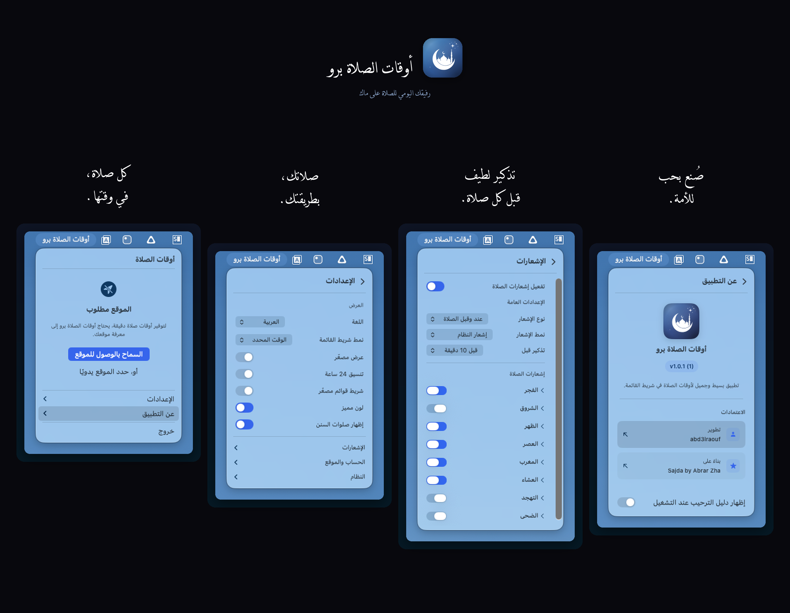

<p align="center">
    <a href="README.md">English</a> | <strong>العربية</strong> | <a href="README.id.md">Indonesia</a> | <a href="README.fa.md">فارسی</a> | <a href="README.ur.md">اردو</a>
</p>

<p align="center">
    
</p>

<p align="center">تطبيق بسيط لأوقات الصلاة يعيش في شريط القوائم على جهاز ماك.</p>

<p align="center">
    <a href="#التثبيت">
        
    </a>
</p>

---

<p align="center">
    
</p>

## ما يقدمه التطبيق

- يعرض أوقات الصلاة في شريط القوائم مع عد تنازلي أو الوقت المحدد
- يرسل إشعارات قبل كل صلاة
- يكتشف موقعك تلقائيًا (أو يمكنك تعيينه يدويًا)
- يدعم طرق حساب متعددة (رابطة العالم الإسلامي، الجمعية الإسلامية لأمريكا الشمالية، أم القرى، وزارة الشؤون الدينية الإندونيسية، رئاسة الشؤون الدينية التركية، وغيرها)
- يتيح لك تعديل وقت كل صلاة ليتوافق مع مسجدك المحلي
- يعمل بالعربية والإنجليزية والإندونيسية والفارسية والأردية
- يتبع وضع النظام الفاتح/الداكن

## أنماط شريط القوائم

اختر كيفية ظهور أوقات الصلاة في شريط القوائم:

- **عد تنازلي** - `Asr in 24m`
- **الوقت المحدد** - `Maghrib at 6:05 PM`
- **مختصر** - `Asr -2h 4m`
- **أيقونة فقط** - مجرد أيقونة هلال

## التثبيت

**يتطلب macOS Ventura (13.0) أو أحدث.** يعمل على أجهزة ماك بمعالجات Apple Silicon و Intel.

1. حمّل أحدث ملف `.dmg` من [الإصدارات](https://github.com/abd3lraouf/PrayerTimes/releases)
2. افتح ملف DMG واسحب تطبيق PrayerTimes إلى مجلد التطبيقات
3. انقر بزر الفأرة الأيمن على التطبيق في مجلد التطبيقات واختر **فتح** (مطلوب في المرة الأولى لأن التطبيق غير موثّق من آبل)

<details>
<summary>هل لا تزال تحصل على تحذير أمني؟</summary>

**الخيار أ:** انتقل إلى إعدادات النظام > الخصوصية والأمان، ثم مرر للأسفل وانقر على "فتح على أي حال".

**الخيار ب:** نفّذ هذا الأمر في الطرفية:
```bash
xattr -r -d com.apple.quarantine /Applications/PrayerTimes.app
```

التطبيق مفتوح المصدر وآمن للاستخدام. يظهر نظام macOS هذا التحذير لأي تطبيق يتم تحميله من خارج متجر التطبيقات ولم يدفع مقابل خدمة التوثيق من آبل.

</details>

<details>
<summary>البناء من المصدر</summary>

```bash
git clone https://github.com/abd3lraouf/PrayerTimes.git
cd PrayerTimes
open PrayerTimes.xcodeproj
```

ثم اضغط Cmd+R في Xcode للبناء والتشغيل.

</details>

## الخصوصية

- لا تتبع، ولا تحليلات، ولا جمع بيانات
- جميع الإعدادات مخزنة محليًا على جهاز ماك الخاص بك
- يُستخدم الاتصال بالشبكة فقط للبحث عن الموقع (OpenStreetMap)
- مفتوح المصدر بالكامل - يمكنك قراءة كل سطر من الشفرة البرمجية بنفسك

## استكشاف الأخطاء

**التطبيق لا يفتح؟** اتبع خطوات الأمان المذكورة أعلاه. أمر الطرفية هو الحل المضمون.

**الموقع لا يعمل؟** فعّل الوصول إلى الموقع في إعدادات النظام > الخصوصية والأمان > خدمات الموقع.

**لا تصلك إشعارات؟** تحقق من إعدادات النظام > الإشعارات وتأكد من أن تطبيق PrayerTimes مفعّل.

## الشكر والتقدير

مبني على [سجدة](https://github.com/ikoshura/Sajda) بواسطة [ikoshura](https://github.com/ikoshura).

يستخدم [أذان](https://github.com/batoulapps/Adhan) لحساب أوقات الصلاة، و[FluidMenuBarExtra](https://github.com/lfroms/fluid-menu-bar-extra) لنافذة شريط القوائم، و[NavigationStack](https://github.com/indieSoftware/NavigationStack) للتنقل بين العروض.

## المساهمة

المساهمات مرحب بها! انسخ المستودع، أو افتح طلب دمج، أو أبلغ عن مشكلة.

## الرخصة

MIT License. انظر ملف `LICENSE` للتفاصيل.

---

<p align="center">
    
</p>
