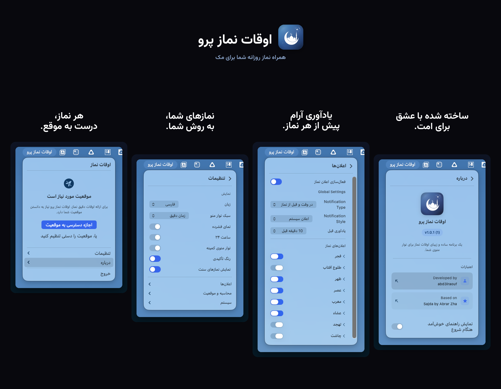

<p align="center">
    <a href="README.md">English</a> | <a href="README.ar.md">العربية</a> | <a href="README.id.md">Indonesia</a> | <strong>فارسی</strong> | <a href="README.ur.md">اردو</a>
</p>

<p align="center">
    
</p>

<p align="center">یک برنامه ساده اوقات نماز که در نوار منوی مک شما زندگی می‌کند.</p>

<p align="center">
    <a href="#نصب">
        
    </a>
</p>

---

<p align="center">
    
</p>

## امکانات

- نمایش اوقات نماز در نوار منو با شمارش معکوس یا زمان دقیق
- ارسال اعلان پیش از هر نماز
- شناسایی خودکار موقعیت مکانی شما (یا تنظیم دستی آن)
- پشتیبانی از روش‌های مختلف محاسبه (MWL، ISNA، ام‌القری، کمناگ، دیانت و غیره)
- امکان تنظیم هر وقت نماز برای مطابقت با مسجد محلی شما
- پشتیبانی از زبان‌های انگلیسی، عربی، اندونزیایی، فارسی و اردو
- سازگاری با حالت روشن/تاریک سیستم شما

## سبک‌های نوار منو

نحوه نمایش اوقات نماز در نوار منو را انتخاب کنید:

- **شمارش معکوس** - `Asr in 24m`
- **زمان دقیق** - `Maghrib at 6:05 PM`
- **فشرده** - `Asr -2h 4m`
- **فقط آیکون** - فقط یک آیکون ماه

## نصب

**نیاز به macOS Ventura (13.0) یا بالاتر دارد.** روی مک‌های Apple Silicon و Intel کار می‌کند.

1. آخرین فایل `.dmg` را از [انتشارها](https://github.com/abd3lraouf/PrayerTimes/releases) دانلود کنید
2. فایل DMG را باز کرده و PrayerTimes را به پوشه Applications بکشید
3. روی برنامه در Applications راست‌کلیک کرده و **Open** را انتخاب کنید (برای بار اول لازم است چون برنامه تایید نشده است)

<details>
<summary>هنوز هشدار امنیتی دریافت می‌کنید؟</summary>

**روش اول:** به System Settings > Privacy & Security بروید، به پایین اسکرول کنید و روی "Open Anyway" کلیک کنید.

**روش دوم:** این دستور را در ترمینال اجرا کنید:
```bash
xattr -r -d com.apple.quarantine /Applications/PrayerTimes.app
```

این برنامه متن‌باز و امن است. macOS این هشدار را برای هر برنامه‌ای که خارج از App Store دانلود شده و هزینه سرویس تایید اپل را پرداخت نکرده باشد نمایش می‌دهد.

</details>

<details>
<summary>ساخت از کد منبع</summary>

```bash
git clone https://github.com/abd3lraouf/PrayerTimes.git
cd PrayerTimes
open PrayerTimes.xcodeproj
```

سپس در Xcode کلیدهای Cmd+R را برای ساخت و اجرا فشار دهید.

</details>

## حریم خصوصی

- بدون ردیابی، تحلیل داده یا جمع‌آوری اطلاعات
- تمام تنظیمات به صورت محلی روی مک شما ذخیره می‌شوند
- از شبکه فقط برای جستجوی موقعیت مکانی استفاده می‌شود (OpenStreetMap)
- کاملا متن‌باز - خودتان هر خط از کد را بخوانید

## عیب‌یابی

**برنامه باز نمی‌شود؟** مراحل امنیتی بالا را دنبال کنید. دستور ترمینال راه‌حل تضمینی است.

**موقعیت مکانی کار نمی‌کند؟** دسترسی موقعیت مکانی را در System Settings > Privacy & Security > Location Services فعال کنید.

**اعلان‌ها نمایش داده نمی‌شوند؟** System Settings > Notifications را بررسی کنید و مطمئن شوید PrayerTimes فعال است.

## قدردانی

بر اساس [Sajda](https://github.com/ikoshura/Sajda) ساخته شده توسط [ikoshura](https://github.com/ikoshura).

از [Adhan](https://github.com/batoulapps/Adhan) برای محاسبه اوقات نماز، [FluidMenuBarExtra](https://github.com/lfroms/fluid-menu-bar-extra) برای پنجره نوار منو و [NavigationStack](https://github.com/indieSoftware/NavigationStack) برای ناوبری نماها استفاده می‌کند.

## مشارکت

از مشارکت شما استقبال می‌کنیم! مخزن را فورک کنید، یک PR بفرستید یا یک issue ثبت کنید.

## مجوز

MIT License. برای جزئیات فایل `LICENSE` را ببینید.

---

<p align="center">
    
</p>
