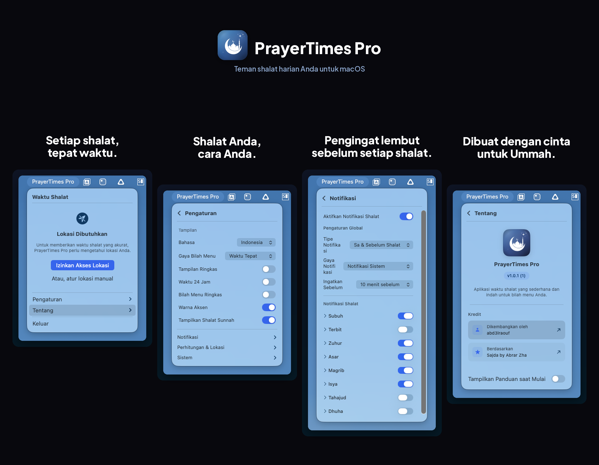

<p align="center">
    <a href="README.md">English</a> | <a href="README.ar.md">العربية</a> | <strong>Indonesia</strong> | <a href="README.fa.md">فارسی</a> | <a href="README.ur.md">اردو</a>
</p>

<p align="center">
    
</p>

<p align="center">Aplikasi waktu shalat sederhana yang tinggal di menu bar Mac Anda.</p>

<p align="center">
    <a href="#instalasi">
        
    </a>
</p>

---

<p align="center">
    
</p>

## Fitur

- Menampilkan waktu shalat di menu bar dengan hitung mundur atau waktu pasti
- Mengirim notifikasi sebelum setiap waktu shalat
- Mendeteksi lokasi Anda secara otomatis (atau atur secara manual)
- Mendukung berbagai metode perhitungan (MWL, ISNA, Umm al-Qura, Kemenag, Diyanet, dan lainnya)
- Memungkinkan Anda menyesuaikan setiap waktu shalat agar sesuai dengan masjid setempat
- Tersedia dalam Bahasa Inggris, Arab, Indonesia, Persia, dan Urdu
- Mengikuti mode terang/gelap sistem Anda

## Gaya menu bar

Pilih tampilan waktu shalat di menu bar Anda:

- **Hitung mundur** - `Asr in 24m`
- **Waktu pasti** - `Maghrib at 6:05 PM`
- **Ringkas** - `Asr -2h 4m`
- **Ikon saja** - Hanya ikon bulan

## Instalasi

**Membutuhkan macOS Ventura (13.0) atau lebih baru.** Berjalan di Mac Apple Silicon maupun Intel.

1. Unduh file `.dmg` terbaru dari [Rilis](https://github.com/abd3lraouf/PrayerTimes/releases)
2. Buka DMG dan seret PrayerTimes ke Applications
3. Klik kanan aplikasi di Applications dan pilih **Open** (diperlukan saat pertama kali karena aplikasi belum dinotarisasi)

<details>
<summary>Masih mendapat peringatan keamanan?</summary>

**Opsi A:** Buka System Settings > Privacy & Security, gulir ke bawah, lalu klik "Open Anyway."

**Opsi B:** Jalankan perintah ini di Terminal:
```bash
xattr -r -d com.apple.quarantine /Applications/PrayerTimes.app
```

Aplikasi ini bersifat open-source dan aman digunakan. macOS menampilkan peringatan ini untuk semua aplikasi yang diunduh di luar App Store dan belum membayar layanan notarisasi Apple.

</details>

<details>
<summary>Build dari kode sumber</summary>

```bash
git clone https://github.com/abd3lraouf/PrayerTimes.git
cd PrayerTimes
open PrayerTimes.xcodeproj
```

Kemudian tekan Cmd+R di Xcode untuk build dan menjalankan aplikasi.

</details>

## Privasi

- Tanpa pelacakan, analitik, atau pengumpulan data
- Semua pengaturan disimpan secara lokal di Mac Anda
- Jaringan hanya digunakan untuk pencarian lokasi (OpenStreetMap)
- Sepenuhnya open-source - Anda bisa membaca setiap baris kodenya sendiri

## Pemecahan Masalah

**Aplikasi tidak bisa dibuka?** Ikuti langkah keamanan di atas. Perintah Terminal adalah solusi yang pasti berhasil.

**Lokasi tidak berfungsi?** Aktifkan akses lokasi di System Settings > Privacy & Security > Location Services.

**Tidak ada notifikasi?** Periksa System Settings > Notifications dan pastikan PrayerTimes sudah diaktifkan.

## Kredit

Berdasarkan [Sajda](https://github.com/ikoshura/Sajda) oleh [ikoshura](https://github.com/ikoshura).

Menggunakan [Adhan](https://github.com/batoulapps/Adhan) untuk perhitungan waktu shalat, [FluidMenuBarExtra](https://github.com/lfroms/fluid-menu-bar-extra) untuk jendela menu bar, dan [NavigationStack](https://github.com/indieSoftware/NavigationStack) untuk navigasi tampilan.

## Kontribusi

Kontribusi sangat diterima! Fork repositori ini, buat PR, atau ajukan issue.

## Lisensi

MIT License. Lihat `LICENSE` untuk detail selengkapnya.

---

<p align="center">
    
</p>
