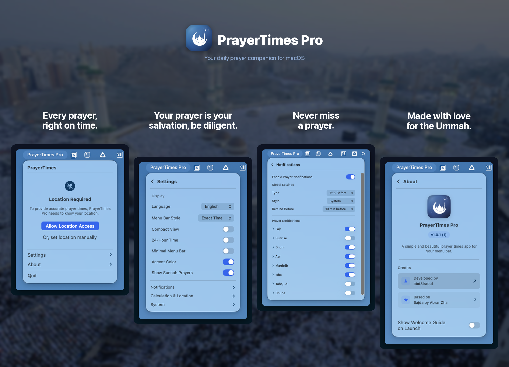

<p align="center">
    <strong>English</strong> | <a href="README.ar.md">العربية</a> | <a href="README.id.md">Indonesia</a> | <a href="README.fa.md">فارسی</a> | <a href="README.ur.md">اردو</a>
</p>

<p align="center">
    
</p>

<p align="center">Prayer times in your Mac's menu bar.</p>

<p align="center">
    
</p>

## Install

**macOS 13+** · Apple Silicon & Intel

```bash
brew install --cask abd3lraouf/prayertimes/prayertimes
```

Or download the `.dmg` from [Releases](https://github.com/abd3lraouf/PrayerTimes/releases). If macOS blocks it:

```bash
xattr -r -d com.apple.quarantine /Applications/PrayerTimes.app
```

## Features

- Menu bar countdown, exact time, compact, or icon-only display
- Notifications before and at prayer time, with optional full-screen alerts
- Locale-aware numerals (Arabic-Indic, Extended Arabic-Indic, Western)
- Auto or manual location · multiple calculation methods (MWL, ISNA, Umm al-Qura, Kemenag, Diyanet, etc.)
- Per-prayer time adjustments to match your local mosque
- English, Arabic, Indonesian, Persian, Urdu
- Light/dark mode · Ramadan Suhoor/Iftar notifications

## Privacy

No tracking, no analytics. All data stays on your Mac. Network used only for location search (OpenStreetMap). Fully open-source.

## Build from source

```bash
git clone https://github.com/abd3lraouf/PrayerTimes.git
cd PrayerTimes && open PrayerTimes.xcodeproj
```

## Credits

Based on [Sajda](https://github.com/ikoshura/Sajda). Uses [Adhan](https://github.com/batoulapps/Adhan), [FluidMenuBarExtra](https://github.com/lfroms/fluid-menu-bar-extra), and [NavigationStack](https://github.com/indieSoftware/NavigationStack).

## License

MIT
