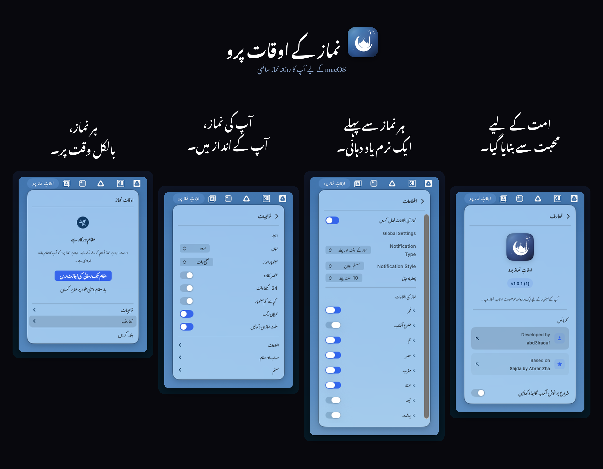

<p align="center">
    <a href="README.md">English</a> | <a href="README.ar.md">العربية</a> | <a href="README.id.md">Indonesia</a> | <a href="README.fa.md">فارسی</a> | <strong>اردو</strong>
</p>

<p align="center">
    
</p>

<p align="center">ایک سادہ نماز کے اوقات کی ایپ جو آپ کے میک کے مینو بار میں رہتی ہے۔</p>

<p align="center">
    <a href="#تنصیب">
        
    </a>
</p>

---

<p align="center">
    
</p>

## خصوصیات

- مینو بار میں نماز کے اوقات الٹی گنتی یا صحیح وقت کے ساتھ دکھاتی ہے
- ہر نماز سے پہلے اطلاعات بھیجتی ہے
- آپ کا مقام خود بخود معلوم کرتی ہے (یا دستی طور پر مقرر کریں)
- متعدد حساب کے طریقوں کی حمایت کرتی ہے (MWL، ISNA، ام القری، کیمیناگ، دیانت، اور مزید)
- آپ کو ہر نماز کا وقت اپنی مقامی مسجد کے مطابق ایڈجسٹ کرنے دیتی ہے
- انگریزی، عربی، انڈونیشیائی، فارسی، اور اردو میں کام کرتی ہے
- آپ کے سسٹم کے لائٹ/ڈارک موڈ کی پیروی کرتی ہے

## مینو بار کے انداز

منتخب کریں کہ نماز کے اوقات مینو بار میں کیسے ظاہر ہوں:

- **الٹی گنتی** - `Asr in 24m`
- **صحیح وقت** - `Maghrib at 6:05 PM`
- **مختصر** - `Asr -2h 4m`
- **صرف آئیکن** - صرف چاند کا آئیکن

## تنصیب

**macOS Ventura (13.0) یا اس کے بعد کا ورژن درکار ہے۔** Apple Silicon اور Intel دونوں میک پر کام کرتی ہے۔

### Homebrew

```bash
brew tap abd3lraouf/prayertimes
brew install --cask prayertimes
```

### دستی

1. تازہ ترین `.dmg` [ریلیزز](https://github.com/abd3lraouf/PrayerTimes/releases) سے ڈاؤن لوڈ کریں
2. DMG کھولیں اور **PrayerTimes** کو ایپلیکیشنز میں ڈریگ کریں
3. ایپلیکیشنز میں ایپ پر رائٹ کلک کریں اور **Open** منتخب کریں (پہلی بار ضروری ہے کیونکہ ایپ نوٹرائزڈ نہیں ہے)

<details>
<summary>ابھی بھی سیکیورٹی وارننگ آ رہی ہے؟</summary>

**طریقہ الف:** System Settings > Privacy & Security میں جائیں، نیچے سکرول کریں، اور "Open Anyway" پر کلک کریں۔

**طریقہ ب:** ٹرمینل میں یہ کمانڈ چلائیں:
```bash
xattr -r -d com.apple.quarantine /Applications/PrayerTimes.app
```

یہ ایپ اوپن سورس ہے اور استعمال کرنا محفوظ ہے۔ macOS یہ وارننگ ایسی کسی بھی ایپ کے لیے دکھاتا ہے جو App Store کے باہر سے ڈاؤن لوڈ کی گئی ہو اور جس نے Apple کی نوٹرائزیشن سروس کی فیس ادا نہ کی ہو۔

</details>

<details>
<summary>سورس کوڈ سے بنائیں</summary>

```bash
git clone https://github.com/abd3lraouf/PrayerTimes.git
cd PrayerTimes
open PrayerTimes.xcodeproj
```

پھر Xcode میں Cmd+R دبائیں تاکہ ایپ بن کر چلے۔

</details>

## رازداری

- کوئی ٹریکنگ، اینالیٹکس، یا ڈیٹا اکٹھا نہیں کیا جاتا
- تمام ترتیبات آپ کے میک پر مقامی طور پر محفوظ ہوتی ہیں
- نیٹ ورک صرف مقام کی تلاش کے لیے استعمال ہوتا ہے (OpenStreetMap)
- مکمل طور پر اوپن سورس - کوڈ کی ہر سطر خود پڑھیں

## مسائل کا حل

**ایپ نہیں کھل رہی؟** اوپر دیے گئے سیکیورٹی اقدامات پر عمل کریں۔ ٹرمینل کمانڈ یقینی حل ہے۔

**مقام کام نہیں کر رہا؟** System Settings > Privacy & Security > Location Services میں مقام کی اجازت فعال کریں۔

**اطلاعات نہیں آ رہیں؟** System Settings > Notifications چیک کریں اور یقینی بنائیں کہ PrayerTimes فعال ہے۔

## کریڈٹس

[ikoshura](https://github.com/ikoshura) کی [Sajda](https://github.com/ikoshura/Sajda) پر مبنی۔

نماز کے اوقات کے حساب کے لیے [Adhan](https://github.com/batoulapps/Adhan)، مینو بار ونڈو کے لیے [FluidMenuBarExtra](https://github.com/lfroms/fluid-menu-bar-extra)، اور ویو نیویگیشن کے لیے [NavigationStack](https://github.com/indieSoftware/NavigationStack) استعمال کرتی ہے۔

## تعاون

تعاون خوش آئند ہے! ریپو فورک کریں، PR کھولیں، یا ایشو درج کریں۔

## لائسنس

MIT License۔ تفصیلات کے لیے `LICENSE` دیکھیں۔

---

<p align="center">
    
</p>
